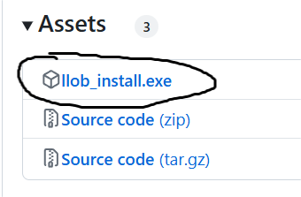
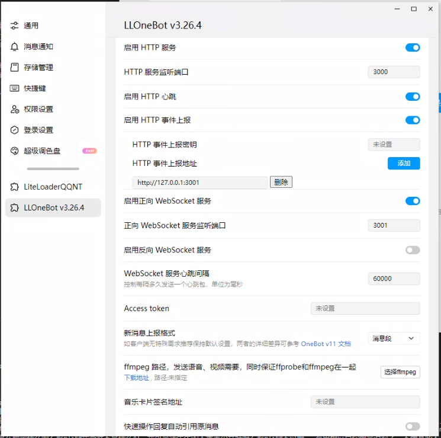
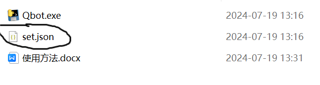
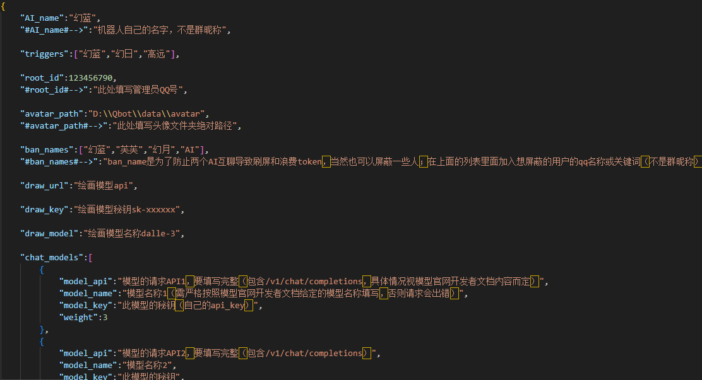

# 推荐
推荐大模型：GLM0520模型，能力很强，且新用户可以免费白嫖，可以用这个来体验本项目。

链接：https://www.bigmodel.cn

**注：智谱清言`glm-4-flash`已对所有用户完全免费调用。**

# v0.9.7更新：
1. 采用模型团方案，可以填写多个模型，根据权重调用，建议选取一个高性能模型和两个便宜模型，既可以在保证能力的同时节省费用，还可以避免大模型回复模板化的问题
2. 允许AI自己在适当的时候发送data/smusic文件夹内的歌曲
3. 允许多个触发词（在set.json里配置）
4. 允许多个屏蔽名称（在set.json里配置）
5. 增加更多set.json可配置内容
6. 增加由AI自己驱动总结的中期记忆能力（效果明显）[写入记忆]
7. 允许AI拒绝回答不相干问题[pass]
8. 将file.py集成在Qbot中，不需要再手动启动
9. AI自己根据需要和对应情绪发送表情包图片
10. 自己根据需要切换对应人设
11. 加入人设扩展，可在`data/char.txt`编辑剧情等超长人设，通过匹配消息正则表达式调出对应部分
12. 更新过渡：
- 认真阅读最新版`set.json`，并根据里面的说明做相应修改
- `file.py`已合并入`Qbot`

# 前言：
    感谢大家使用本开源项目，本项目旨在快速帮助大家构建一个自己的QQ机器人

    本项目部署的qq机器人拥有以下能力：
    1. 智能断句：利用AI能力为输出打上断句标签，合理断句，既可以保证长内容回复的完整性，也可以避免AI回复长段内容
    2. 智能意图判断：利用AI能力给输出打上标签，实现不同回复内容经过特殊函数处理，例如：文本转语音，AI绘图等
    3. 拥有语音回复，AI绘画回复等常见的回复形式，让回复更加多样化
    4. 由AI自己选择或决定何时播放播放本地歌曲
    5. 由AI自己决定发送表情包的时机
    6. 由AI自己决定何时切换人设
    7. 由AI自己决定何时写入记忆

    本项目站在巨人的肩膀上，使用了其他的一些开源项目，大家可以给对应项目点一个star哦~

# 准备：
1. 首先，下载并安装NTQQ（一种新架构的QQ电脑端）：
   [NTQQ下载链接](https://im.qq.com/pcqq/index.shtml)

2. 安装LLonebot的NTQQ插件：
   [NTQQ插件链接](https://github.com/LLOneBot/LLOneBot)
   安装方法：[点击查看](https://llonebot.github.io/zh-CN/guide/getting-started)
   如果是Windows系统，注意下载如下名称的较新版本exe：
    

3. 配置LLonebot插件：
   安装好插件后，打开ntqq进入插件设置
   填写各种信息（千万不要忘记填写端口号）后，**注意保存！！！**
    

# 开始：
1. 配置：
   进入此文件
   
    
    

   解释：
   - `triggers`后面填入触发词列表，可设置多个触发词，如果用户发送的消息里包含这个词，会触发回复。
   - `system_prompt`后面填的就是AI人设，建议参考默认人设的格式，效果会更好。
   - `chat_models`后面填模型团列表信息，其中每个模型信息需要填写请求api，模型名称，请求key；切忌自己编造，需查看模型官方开发者文档，按照官方模型名称严格填写，此项将影响请求模型对象。
   - 其他的配置项大家应该可以看懂是什么，画图模型配置类比文本模型。

2. 修改：
   - 进入`Qbot.py`源代码编辑页面。

3. 启动：
   安装必要的库：
   打开命令行（win+r，输入cmd并回车），先cd到Qbot-main根目录，然后输入以下命令：
   ```cmd
   pip install -r requirements.txt
   ```
   保持NTQQ的运行状态，然后使用`python Qbot.py`完成启动。

   （遇到问题可以联系开发者幻日QQ：2141073363）

# 补充：
将音乐放在data/smusic文件夹下，AI适当的时候会自己从中选取合适歌曲发送（音乐不适宜太多（<20个），否则AI可能不按要求选取歌曲）
表情包放在data/image/情绪对应文件夹下，目前只有happy,angry,sad,bored,fear五个情绪，可以自行向文件夹中添加表情包，某些格式文件可能不支持

由于我的服务器可能无法支撑大量的语音合成请求，所以大家需要自己部署本地语音合成。本地语音合成可以使用AI桌宠的语音合成服务（即箱庭GPT-Sovits整合包，使用花火模型，双击starttts.bat即可），二者接口格式一样。

[箱庭GPT-Sovits整合包项目](https://github.com/X-T-E-R/GPT-SoVITS-Inference)
[箱庭GPT-Sovits整合包文档](https://www.yuque.com/xter/zibxlp/kkicvpiogcou5lgp)

部署好之后，只需要启动其中的后端并在根目录按照格式建立空文件夹（[Qbot根目录]\data\voice）即可，本项目会自动使用本地语音合成进行语音输出。

**如果启用了绘画或者语音合成等需要发送文件到QQ的服务时，不需要同时启动另一个名为`file.py`的程序。此程序已经内置于Qbot中**

如果想体验原开发者幻日原汁原味的Qbot，请前往`master-illue`分支。

**分支介绍：**
- `main`：主分支，两个开发者合并的代码。
- `master-illue`：原开发者自己的分支，没有合并分开发者的代码。
- `GaoYuan`：分开发者的Debug分支，无须关注。

# 命令说明:
1. `#sudo`：用于获取私信验证码，作为管理员账户失效时的备用验证方案。将私信获得到的6位验证码与需要管理员权限执行的命令在同一条消息中发送，命令将被正常执行。
2. `#暂停`：暂停程序收发消息，仅保留命令功能，需要管理员权限。
3. `#继续`：继续程序收发消息，需要管理员权限。
4. `#reset`：清空当前聊天（群聊/私聊）短期记忆，群聊需要管理员权限。
5. `#clear`：删除个人（群聊/私聊）长期记忆，如果在群聊中发送将删除机器人对此人在群聊中的长期记忆，如果在私聊中发送将删除机器人对此人在私聊中的长期记忆。
6. `#erase`：删除所有长期记忆，需要管理员权限。

# 常见问题：
1. 程序闪退：很可能是因为`set.json`的编码格式不对，推测因为经常使用windows记事本编辑导致编码格式自动转换为UTF-8 with BOM，此处建议安装VScode，然后用VScode打开json，在右下角点击`UTF-8 with BOM`，在顶部的选项栏中选择`保存为编码格式`，点击`UTF-8`即可。
2. 无法接收发送消息且无报错：建议检查QQ插件设置项填写是否完整，尤其是请求地址。
3. 语音合成失败：玄学问题，建议关了重开。
4. 语音合成提示无需重复启动（桌宠用户常见问题）：建议把所有Python后台都删掉再试试（推荐）；或者直接修改`starttts.bat`，将其后台进程检测判断逻辑删除即可（不建议）。
5. “由于远程主机积极拒绝，无法连接”：可能是请求次数过多，超过了每分钟或每天的请求次数限制，等一等就好。
6. `break limitless turn`：正常行为。AI之间防刷屏的代码。
7. AI无缘无故给别人发送多条消息：检查电脑是否同时登录多个开启`LLOneBot`插件的QQ，导致其它账号聊天信息误传入程序错误回复回复。比如大号跟别人聊天，接收消息通过大号未关闭的`LLOneBot`传入程序，程序通过小号`LLOneBot`回复给大号聊天对象，从而无缘无故回复。

# 请求：
***觉得本项目有用的话就点一个star吧~***
