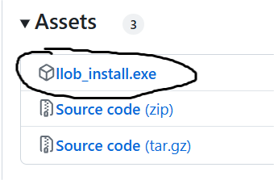
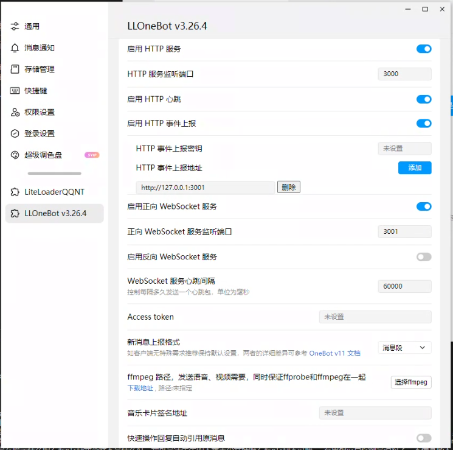
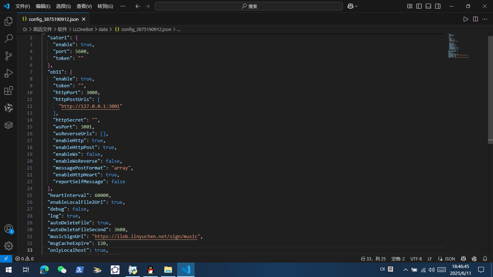
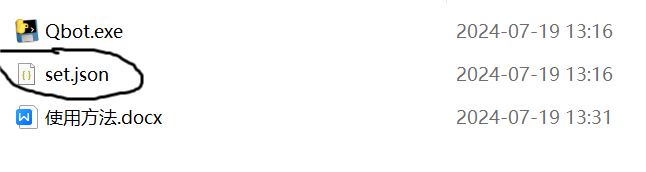
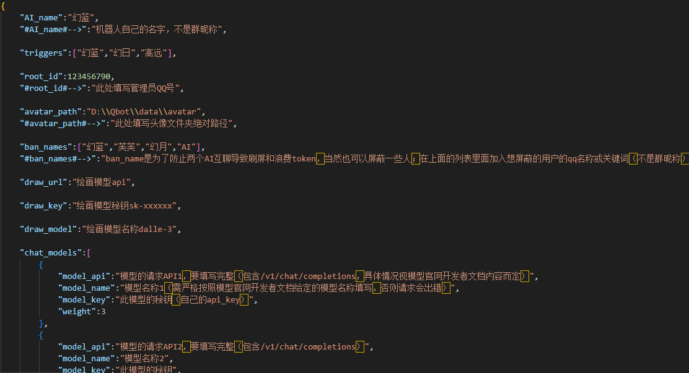

# 11.12更新：
1.加入更多管理员指令：

    触发词#addid 群友id：将群友添加为当前群qbot管理员，有权限使用几乎所有指令

    触发词#forcememory 记忆内容：强制AI添加本群中期记忆

    触发词#forceallmemory 记忆内容：强制AI在所有群添加中期记忆（只有set里面配置的id可使用此指令）

2.简化配置难度，将更多配置整合在set.json中（说话人，歌者以及是否启用相应能力配置等）

3.兼容某些AI接口流式传输时一个流传输多个token的情况，修复相关bug

4.修改AI自动切换设定及情感的相关参数为更合适的值

5.修复已知bug

# 10.28更新：
1.加入管理员功能和指令：在set.json里面填写管理员qq号列表即可，指令包括：“触发词#mood 情绪”（设置本群AI的情绪，相关情绪在set里面的系统人设里面修改或添加），“触发词#random 整数”（修改本群AI无触发词的触发概率，整数小于等于0关闭当前群AI）

2.加入多情绪系统提示词功能，可由AI自行切换或管理员手动切换单群的AI情绪模式，即“触发词#mood 情绪”（设置本群AI的情绪，相关情绪在set里面的系统人设里面修改或添加）指令

3.加入单群AI无触发词触发概率修改指令，可修改当前群的触发概率，若设置为0或负值，即可关闭AI在本群的所有能力，后续再设置为正值恢复工作，即“触发词#random 整数”（修改本群AI无触发词的触发概率，整数小于等于0关闭当前群AI）

4.略微增加记忆容量和上下文轮数，限制长期记忆总量

5.修复私聊切换情绪bug

6.将私聊下的歌唱功能改为从群聊翻唱产生的音频中检索歌唱文件，所以群里唱过的歌就可以在私聊中唱了

# 10.25更新：
1.兼容了智谱清言的绘画模型（可以白嫖）

2.加入模型图兜底机制，将模型团首个模型作为兜底模型，用于弥补模型团中若有模型有问题导致偶尔AI不回复的问题，因此首个模型应以稳定为主

3.新功能歌曲AI翻唱：引入一键AI翻唱方案，实现AI自动抓取网易云音乐并预处理后采用svc翻唱（同样由AI自动确定触发时机，只适用于群聊，可自行修改代码扩展至私聊）新功能需要下载工具整合包链接：[https://pan.quark.cn/s/ecae6ee123b4](https://pan.quark.cn/s/ecae6ee123b4)
（下载好后按照配置或训练svc的方法就行配置或训练，然后启动文件夹下的启动服务端.bat，最后在qbot源代码里面修改歌唱者为svc对应歌唱者名就可以了，注意训练好的模型放在翻唱整合包的logs文件夹下，目录结构参考logs下的illue）【如果报错缺少"wcwidth"库，就进入翻唱整合包里面的workenv下打开cmd输入 python -m pip install wcwidth即可解决】


# 往次更新：
1.采用模型团方案，可以填写多个模型，根据权重调用，建议选取一个高性能模型和两个便宜模型，既可以在保证能力的同时节省费用，还可以避免大模型回复模板化的问题

2.允许AI自己在适当的时候发送data/smusic文件夹内的歌曲【本功能已在10.25次更新中被AI翻唱功能取代】

3.允许多个触发词（在set.json里配置）

4.允许多个屏蔽名称（在set.json里配置）

5.增加更多set.json可配置内容

6.增加由AI自己驱动总结的中期记忆能力（效果明显）[写入记忆]

7.允许AI拒绝回答不相干问题[pass]

8.将file.py集成在Qbot中，不需要再手动启动

9.AI自己根据需要和对应情绪发送表情包图片

10.添加char.txt，用于主人手动填写让ai记住的角色设定或者特别警示，由于在遇到相应的对话时，使用正则表达式匹配特定剧情或警示。如：剧情太长，塞到记忆里容易被删，但塞到这里面就不会被删，而且还会选择性匹配。


# 前言：
    感谢大家使用本开源项目，本项目旨在快速帮助大家构建一个自己的QQ机器人

    本项目部署的qq机器人拥有以下能力：
        1.智能断句：利用AI能力为输出打上断句标签，合理断句，既可以保证长内容回复的完整性，
            也可以避免AI回复长段内容
        2.智能意图判断：利用AI能力给输出打上标签，实现不同回复内容经过特殊函数处理，例如
            文本转语音，AI绘图等
        3.拥有语音回复，AI绘画回复等常见的回复形式，让回复更加多样化
        4.由AI自己选择或决定何时播放播放本地歌曲
        5.由AI自己决定发送表情包的时机

    本项目站在巨人的肩膀上，使用了其他的一些开源项目，大家可以给对应项目点一个star哦~
# 准备：

1. 首先，下载并安装NTQQ（一种新架构的QQ电脑端）：

官网：
   [NTQQ下载链接](https://im.qq.com/pcqq/index.shtml)

旧版：
   [NTQQ下载链接](https://bbs.pcbeta.com/viewthread-1969561-1-1.html)
---
- 旧版插件教程

2.1 安装LLonebot的NTQQ插件：
   [NTQQ插件链接](https://github.com/LLOneBot/LLOneBot/releases)
   安装方法：[点击查看](https://llonebot.github.io/zh-CN/guide/getting-started)

   如果是Windows系统，注意下载4.9.9版本的llob_install.exe：
    

3.1 配置LLonebot插件：

   安装好插件后，打开ntqq进入插件设置

   填写各种信息（千万不要忘记填写端口号）后，**注意保存！！！**

    
---
- 新版独立程序教程

2.2 LLOneBot独立程序：
   [LLOneBot程序链接](https://github.com/LLOneBot/LLOneBot/releases)
   安装方法：[点击查看](https://llonebot.github.io/zh-CN/guide/getting-started)

   下载最新版zip文件，如果需要语音合成，则下载带有ffmpeg的版本。定期注意更新。

3.2 配置LLonebot程序：
   安装好程序后，先启动插件目录中的主程序（LLOneBot.exe）

   插件会自动启动新版QQ，正常登录后，即可生成配置文件

   进入插件目录的.../data/config_<你的QQ号>.json配置文件，开始填写设置，**注意检查端口号是否冲突，并关闭正向websocket**

   填写各种信息（千万不要忘记填写端口号）后，**注意保存！！！**
    
---

# 开始：

1. 配置：
   进入此文件
   
    
    

   解释：
   - `triggers`后面填入触发词列表，可设置多个触发词，如果用户发送的消息里包含这个词，会触发回复。
   - `system_prompt`后面填的就是AI人设，建议参考默认人设的格式，效果会更好。
   - `chat_models`后面填模型团列表信息，其中每个模型信息需要填写请求api，模型名称，请求key；切忌自己编造，需查看模型官方开发者文档，按照官方模型名称严格填写，此项将影响请求模型对象。
   - 其他的配置项大家应该可以看懂是什么，画图模型配置类比文本模型。

2. 修改：
   - 进入`Qbot.py`源代码编辑页面。

3. 启动：  
   打开命令行（win+r，输入cmd并回车），先cd到Qbot-main根目录。
   
   可选，推荐大佬/开发者：
   cmd：
   使用venv来避免污染全局环境  
   创建venv：
   ```cmd
   python -m venv .venv
   ```
   激活venv：
   ```cmd
   .venv/Scripts/activate.bat
   ```
   PowerShell：
   激活venv：
   ```PowerShell
   .venv/Scripts/activate.ps1
   ```
   （如果PowerShell报不允许执行）修改该PowerShell实例脚本执行策略：  
   ```PowerShell
   Set-ExecutionPolicy RemoteSigned -Scope Process
   ```
   必须：安装必要的库：  
   ```cmd
   python -m pip install -r requirements.txt
   ```
   保持NTQQ的运行状态，然后使用`python Qbot.py`完成启动。  
   （如果使用venv请先激活venv）  
   （遇到问题可以联系开发者幻日QQ：2141073363，可选venv遇到问题可以联系观赏鱼QQ：2082895869）

# 补充：
将音乐放在data/smusic文件夹下，AI适当的时候会自己从中选取合适歌曲发送（音乐不适宜太多（<20个），否则AI可能不按要求选取歌曲）【本功能已在10.25次更新中被AI翻唱功能取代】
表情包放在data/image/情绪对应文件夹下，目前只有happy,angry,sad,bored,fear五个情绪，可以自行向文件夹中添加表情包，某些格式文件可能不支持

由于我的服务器可能无法支撑大量的语音合成请求，所以大家需要自己部署本地语音合成。本地语音合成可以使用AI桌宠的语音合成服务（即箱庭GPT-Sovits整合包，使用花火模型，双击starttts.bat即可），二者接口格式一样。

[箱庭GPT-Sovits整合包项目](https://github.com/X-T-E-R/GPT-SoVITS-Inference)
[箱庭GPT-Sovits整合包文档](https://www.yuque.com/xter/zibxlp/kkicvpiogcou5lgp)

部署好之后，只需要启动其中的后端并在根目录按照格式建立空文件夹（[Qbot根目录]\data\voice）即可，本项目会自动使用本地语音合成进行语音输出。

**如果启用了绘画或者语音合成等需要发送文件到QQ的服务时，不需要同时启动另一个名为`file.py`的程序。此程序已经内置于Qbot中**
**注意：需要等待`Qbot.py`加载完记忆再启动，否则有概率导致`Qbot.py`无法收发信息！！！**

# 命令说明:
1. `#reset`：清空当前聊天（群聊/私聊）短期记忆。


# 常见问题：
1. 程序闪退：很可能是因为`set.json`的编码格式不对，推测因为经常使用windows记事本编辑导致编码格式自动转换为UTF-8 with BOM，此处建议安装VScode，然后用VScode打开json，在右下角点击`UTF-8 with BOM`，在顶部的选项栏中选择`保存为编码格式`，点击`UTF-8`即可。
2. 无法接收发送消息且无报错：建议检查QQ插件设置项填写是否完整，尤其是请求地址。
3. 语音合成失败：玄学问题，建议关了重开。
4. 语音合成提示无需重复启动（桌宠用户常见问题）：建议把所有Python后台都删掉再试试（推荐）；或者直接修改`starttts.bat`，将其后台进程检测判断逻辑删除即可（不建议）。
5. “由于远程主机积极拒绝，无法连接”：可能是请求次数过多，超过了每分钟或每天的请求次数限制，等一等就好。
6. `break limitless turn`：正常行为。AI之间防刷屏的代码。

# 请求：
***觉得本项目有用的话就点一个star吧~***
